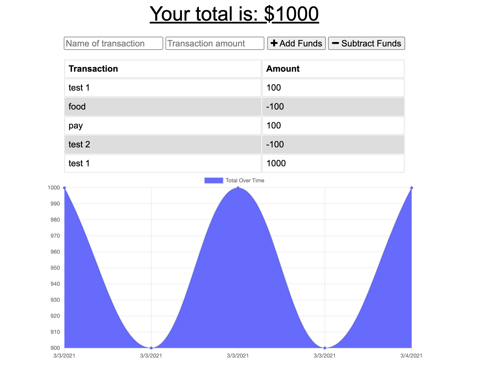

# budget-tracker
  
  

  ## Description
  This is a progressive web app that allows you to store monetary transactions both on and offline. 
  
  ## Table of Contents
  1. [Installation](#Installation)
  2. [Usage](#Usage)
  3. [License](#License)
  6. [Contact Information](#Questions)
  
  ## Installation
  * Fork the project * Run your mongoDB server * run npm i to install dependencies * 

  ## Usage
  Use this project to keep track of your cashflow and see the trends.

  ## License
  This project is licensed under the MIT license.

  ## Questions
  **Github:** [jesusefraingonzalez](https://github.com/jesusefraingonzalez)
  
  Contact me at jesusgonzalez0797@gmail.com with any additional questions. 
  

